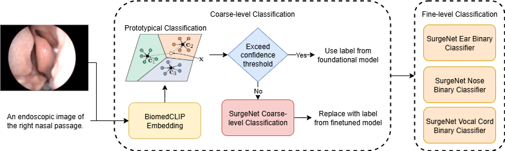
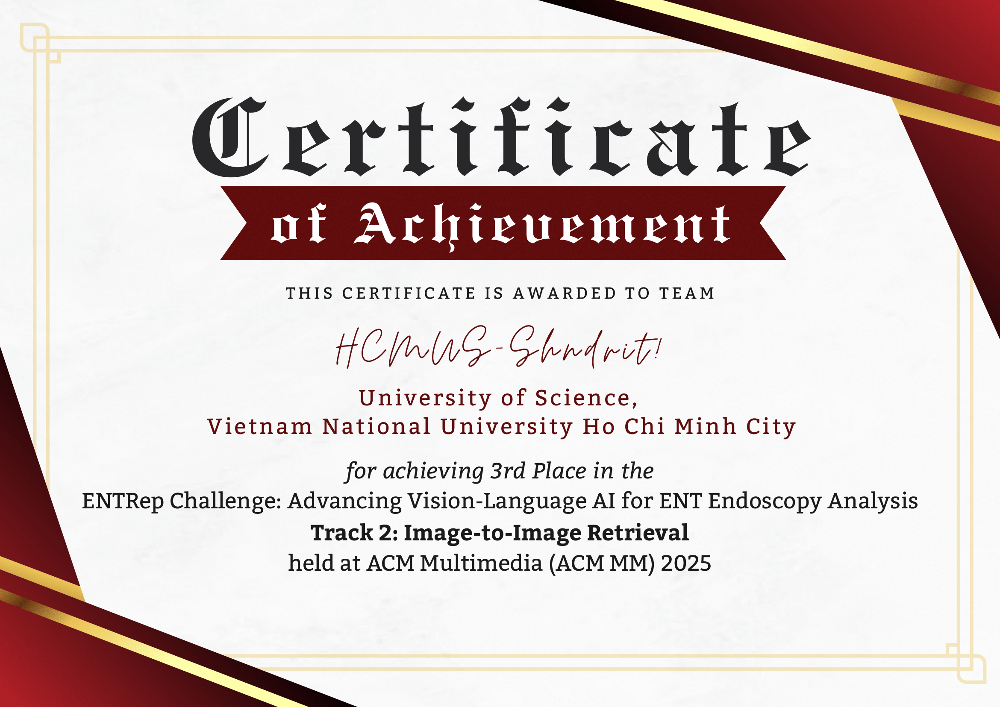

# Fusion at the Foregut: CLIP-Based Prototypical Learning with DINOv2 Refinement for Endoscopic Image Analysis



|  |  |  |
|---|---|---|

## Abstract

This paper presents a multimodal framework for anatomical site classification and retrieval in endoscopic images, integrating CLIP-based prototypical learning with DINOv2 refinement. BiomedCLIP embeddings are used to form joint vision-language prototypes for coarse classification, while DINOv2, pretrained on SurgeNet, handles fine-grained binary classification (Ear/Nose side, Vocal Cord state). A hybrid inference strategy combines semantic alignment from BiomedCLIP with the visual precision of DINOv2, fallbacking to DINOv2 for visually ambiguous or out-of-distribution samples. On the ENTRep Challenge datasets, our model achieved 99.46\% accuracy and 0.9954 macro F1-score for coarse-level classification (4 classes), and 94.09\% accuracy with 0.9442 macro F1 for fine-grained binary classification (7 classes), outperforming both a DINOv2 baseline and the prototype-only method. Our approach placed **5th** in image classification (91.64\% accuracy), **3rd** in image-image retrieval (88.53\% Recall@1), and **6th** in text-image retrieval (84.00\% Recall@1), demonstrating competitive performance across all tracks. Code is available at: **[Github Repository](https://github.com/YangTuanAnh/ENTRep)** **[Jupyter Notebook](entrep-prototypical.ipynb)** **[Kaggle experiments](https://www.kaggle.com/code/yangtunanh/entrep-prototypical)** **[Working note](paper_entrep.pdf)**

## Dataset

You can access the datasets from the official competition page:
[ENTRep Challenge:
Advancing Vision-Language AI for
ENT Endoscopy Analysis](https://aichallenge.hcmus.edu.vn/acm-mm-2025/entrep)

After downloading the data, update the `data_path` variable in [the notebook](./fungiclef25.ipynb) to point to your local dataset directory. The default setup supports execution directly within Kaggle notebooks.

---

## Installation

Set up a Python virtual environment and install the required dependencies.

<details>
<summary><strong>Linux / macOS</strong></summary>

```bash
python -m venv .venv
source .venv/bin/activate
pip install -r requirements.txt
```

</details>

<details>
<summary><strong>Windows</strong></summary>

```cmd
python -m venv .venv
.venv\Scripts\activate
pip install -r requirements.txt
```

</details>

---

## Results

### Table: Hybrid model classification performance on fine-grained binary labels (accuracy: 94.09%)

| **Class**        | **Precision** | **Recall** | **F1-score** | **Support** |
| ---------------- | ------------- | ---------- | ------------ | ----------- |
| Ear-left         | 0.8500        | 0.9444     | 0.8947       | 18          |
| Ear-right        | 0.9474        | 0.9000     | 0.9231       | 20          |
| Nose-left        | 0.9556        | 0.9149     | 0.9348       | 47          |
| Nose-right       | 0.9362        | 0.9565     | 0.9462       | 46          |
| Throat           | 1.0000        | 1.0000     | 1.0000       | 10          |
| VC-closed        | 0.9524        | 0.9524     | 0.9524       | 21          |
| VC-open          | 0.9583        | 0.9583     | 0.9583       | 24          |
| **Macro Avg**    | 0.9428        | 0.9467     | 0.9442       | 186         |
| **Weighted Avg** | 0.9421        | 0.9409     | 0.9410       | 186         |

---

### Table: Comparison between the baseline DINOv2 classifier and prototype-based hybrid models

| **Model**         | **Accuracy** | **Macro F1** | **Weighted F1** |
| ----------------- | ------------ | ------------ | --------------- |
| BioMedCLIP proto. | 55.91%       | 0.5756       | 0.5356          |
| Baseline SurgeNet | 91.40%       | 0.9124       | 0.9135          |
| **Hybrid Model**  | **94.09%**   | **0.9442**   | **0.9410**      |
